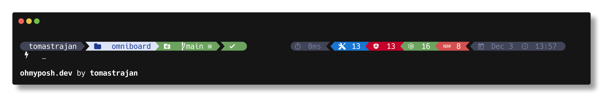

# Angularic oh-my-posh theme

* ✅ Works great with dark terminals
* ✅ Transient prompt


## Angular related prompt segments
* ✅ Angular version (major)
* ✅ NX version (major)
* ✅ Node.js version (major)
* ✅ NPM version (major)

## Other prompt segments and features
* ✅ Current user
* ✅ Git status (behind, ahead, changes, ...)
* ✅ Execution status
* ✅ Execution time
* ✅ Date and time

# Get Started

1. Setup [oh-my-posh](https://ohmyposh.dev/docs/installation/linux) with your terminal and shell
2. Install one of the [Nerd Fonts](https://ohmyposh.dev/docs/installation/fonts)
3. Enable [oh-my-posh prompt](https://ohmyposh.dev/docs/installation/prompt) for your shell
4. Download the theme file `angularic.omp.json`
5. **Enable Angularic theme, eg for fish it would be  `oh-my-posh init fish --config ~/path/to/theme/angularic.omp.json | source`**, check out docs for [other shells](angularic.omp.json)

# Troubleshooting

## Fonts
In general, the `oh-my-posh font install` tries to set up font in your environment.
If that doesn't work and the prompt looks weird, try to set up the font manually.

To do that, perform the following steps:
1. download one of the [Nerd Fonts](https://www.nerdfonts.com/font-downloads) like `JetBrainsMono Nerd Font` or `Meslo Nerd Font`
2. install the font on your system
3. set the font in your terminal app, eg in Windows Terminal it would be using `Settings -> Profiles -> <your-profile> -> Font face -> <your-nerd-font>`

or in `settings.json`

```json5
{
    "profiles": {
        "defaults": {
            "font": {
                // please notice that the font file name and system name might be different
                "face": "JetBrainsMono NF", 
                "weight": "medium"
            }
        }
    }
}
```